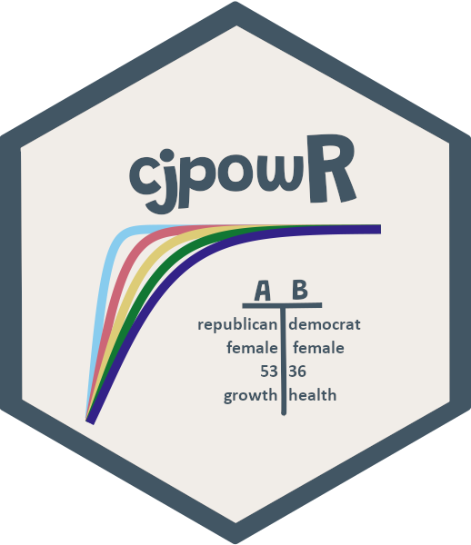

<p align="center"></p>

<h1 align="center">A Priori Power Analyses for Conjoint Experiments</h1>


Based on [Schuessler/Freitag (2020)](https://osf.io/preprints/socarxiv/9yuhp/), this R package provides simple
functions to calculate power, minimum required sample size, Type S and the expected Type M error for forced-choice conjoint experiments.

#### Cite as:

Freitag, Markus and Julian Schuessler (2020). “cjpowR – A Priori Power Analyses for Conjoint Experiments,” R Package. 

## Installation

To install, enter the following lines of code in R:

```{r}
if(!require(devtools)) install.packages("devtools")
library(devtools)
devtools::install_github("m-freitag/cjpowR")
```

## Usage

In its current development version, the package consists of three functions. `cjpowr_amce()` and `cjpowr_amcie()` return a `data.frame`-object holding, depending on the user inputs, the calculated minimum required **effective**<sup>1</sup> sample size or power along with the Type S and the expected Type M Error. 
For convenience, if an effective sample size is provided, power is calculated, whereas if power is provided, the minimum required effective sample size is put out. 
Further, the effect size, the number of levels, the alpha-level and, especially in the case of differences in conditional AMCEs, the treatment probabilities have to be provided.

<sup>1</sup>Effective sample size := the number of respondents * the number of individually assessed profiles * the number of tasks.

## Examples

```{r}
# This gives the minimum required effective sample size (type S, E(type M)):

df = cjpowr_amce(amce = 0.05, power = 0.8, levels = 5)

# For example, for a conjoint with 2 profiles and 4 tasks, n becomes:
df$n/(2*4)

#This gives the power (type S, E(type M)):
cjpowr_amce(amce = 0.05, n = 7829.258, levels = 5)

#Generating an interactive plot for type M error:
d <- expand.grid(
    amce = c(0.01, 0.02, 0.03, 0.05), 
    n = seq(from = 100, to = 50000, 
    length.out = 1000), 
    alpha = 0.05, levels = 2,
    treat.prob = 0.5, 
    sims = 100000)

df <- list2DF(do.call(cjpowr_amce, d))

library(plotly)
plot_ly(df, x = ~n, y = ~exp_typeM, type = 'scatter', mode = 'lines', linetype = ~amce) %>%
 layout(
   xaxis = list(title = "Effective Sample Size",
                zeroline = F,
                hoverformat = '.0f'),
   yaxis = list(title = "Exaggeration Ratio",
                range = c(0,10),
                zeroline = F,
                hoverformat = '.2f'),
   legend=list(title=list(text='<b> AMCE </b>')),
   hovermode = "x unified"
 )
```
